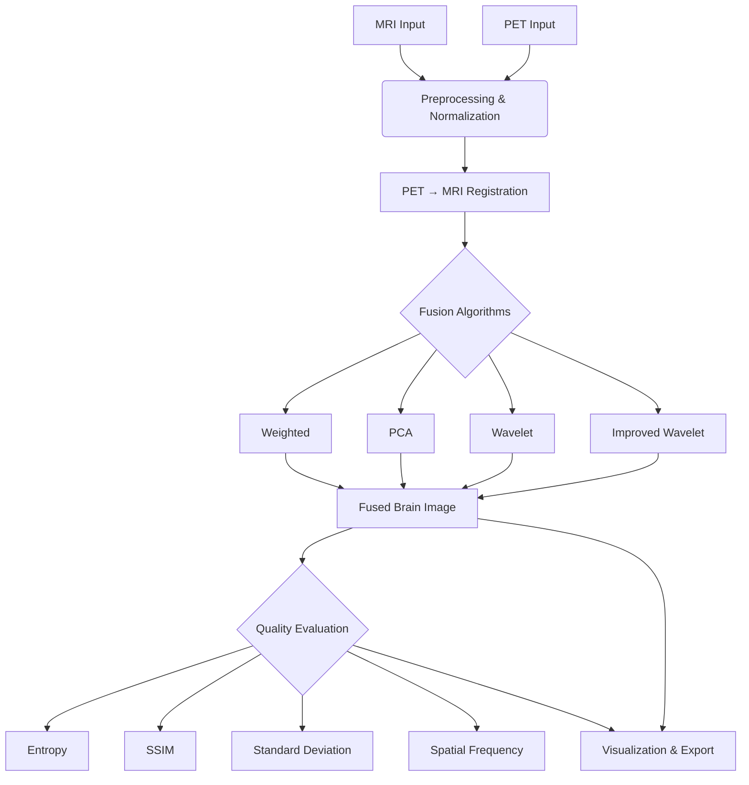
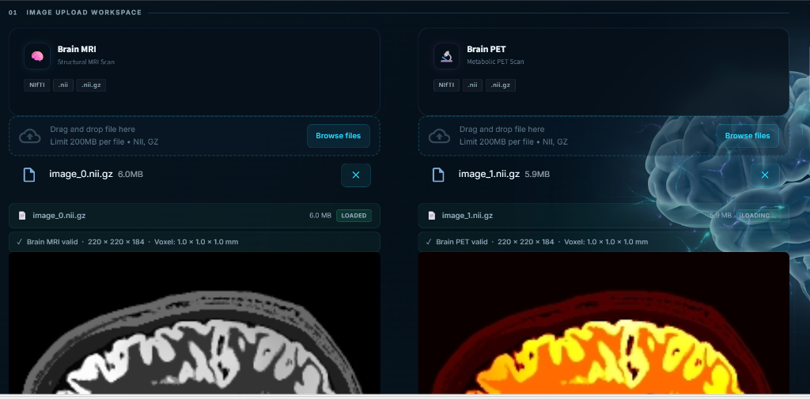
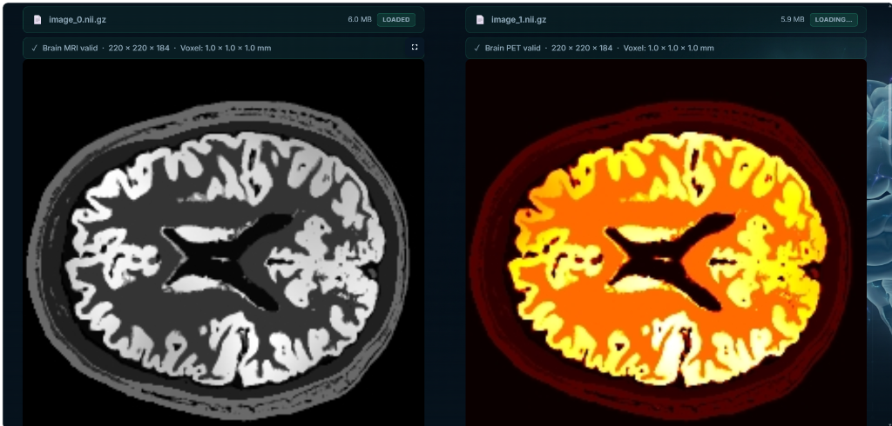
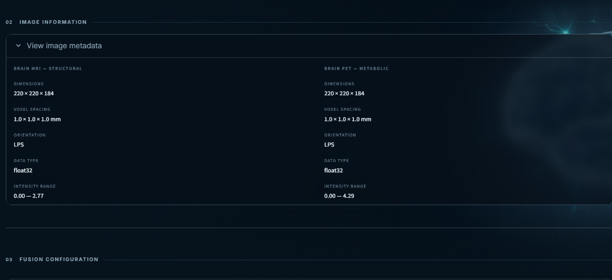
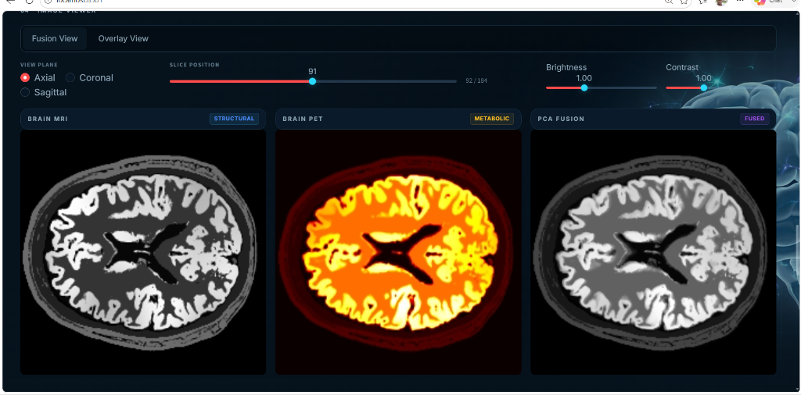
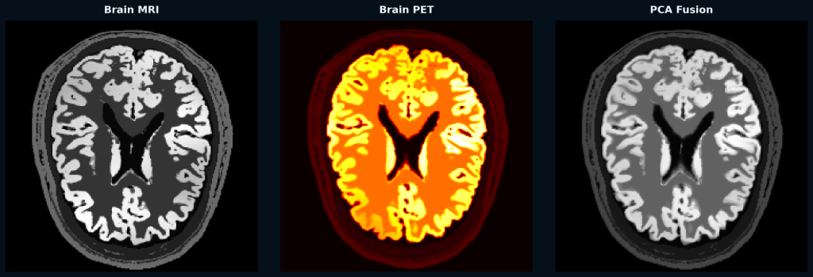
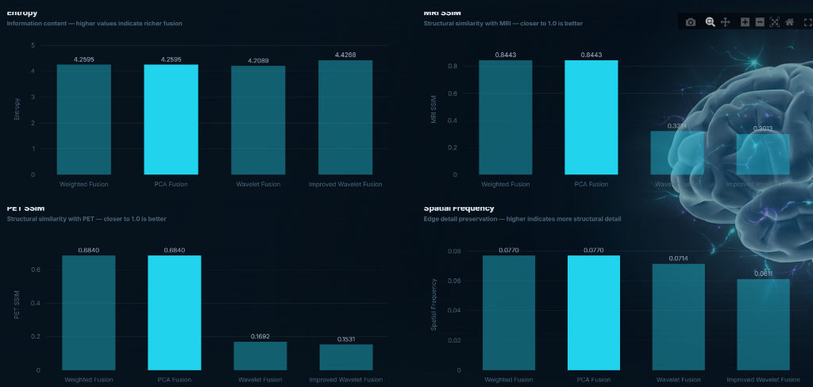

# 🧠 PET–MRI Brain Image Fusion Workstation


A professional multimodal medical image fusion research workstation that combines structural information from MRI with functional/metabolic information from PET using advanced image-fusion techniques. 

---

## ⚠️ Disclaimer
**This project is strictly intended for research and educational demonstrations. It is not a diagnostic medical device and must not be used for clinical diagnosis or medical decision-making.**

---

## Project Overview

Magnetic Resonance Imaging (MRI) provides high-resolution anatomical structure, while Positron Emission Tomography (PET) provides crucial metabolic and functional information. This workstation spatially aligns these two modalities and merges them into a single, fused representation, preserving the critical information from both source images.

### Key Features
- **NIfTI Support**: Native loading and processing of `.nii` and `.nii.gz` volumetric data.
- **Automated Registration**: Rigid spatial alignment (PET → MRI) using SimpleITK with Mattes Mutual Information.
- **Multiple Algorithms**: Implementation of Weighted, PCA, Wavelet, and Improved Wavelet fusion techniques.
- **Quantitative Evaluation**: Real-time calculation of Entropy, SSIM, Standard Deviation, and Spatial Frequency.
- **Interactive UI**: A premium, medical-grade dark-themed workstation interface built with Streamlit.
- **Export Capabilities**: Download fused NIfTI volumes and comparative evaluation reports.

---

## Image Processing Pipeline



---

## Fusion Methods

1. **Weighted Fusion**: Linear intensity blending of the two modalities `(Fused = α × MRI + β × PET)`.
2. **PCA Fusion**: Principal Component Analysis is used to extract and combine the principal structural components from the source images.
3. **Wavelet Fusion**: Discrete Wavelet Transform (DWT) decomposes images into high/low frequency bands which are merged using specialized fusion rules.
4. **Improved Wavelet Fusion**: An enhanced wavelet approach utilizing adaptive weighting for superior preservation of metabolic hotspots and structural boundaries.

---

## Evaluation Metrics

To quantitatively assess fusion performance, the following metrics are calculated:
- **Entropy**: Measures the information content and richness of the fused image.
- **SSIM (Structural Similarity)**: Evaluates how well the structural integrity of the original MRI and PET is preserved in the fused output.
- **Standard Deviation (STD)**: Assesses the overall contrast and intensity variation.
- **Spatial Frequency**: Measures the overall spatial detail and high-frequency activity preserved.

---

## Results

*The following values are experimental results derived from the current testing dataset and should not be interpreted as clinical performance standards.*

| Method | Entropy | MRI SSIM | PET SSIM | STD | Spatial Frequency |
|---|---:|---:|---:|---:|---:|
| Weighted | 2.9407 | 0.7906 | 0.6763 | 0.2835 | 0.0929 |
| PCA | 3.0393 | 0.8069 | 0.8065 | 0.2744 | 0.0748 |
| Wavelet | 2.9879 | 0.2867 | 0.2694 | 0.1920 | 0.0775 |
| Improved Wavelet | 3.1772 | 0.2697 | 0.2621 | 0.1827 | 0.0807 |

---

## 📸 Results & Screenshots

### Application Overview

*The main workstation interface featuring the medical dark theme and modality-specific styling.*

### Image Upload Workspace

*Premium file dropzones with NIfTI validation and format tag highlights.*

### Image Metadata Analysis

*Detailed extraction of volumetric dimensions, voxel spacing, and intensity ranges from the MRI and PET headers.*

### PCA Fusion

*Left: MRI Input | Middle: Registered PET | Right: PCA Fused Output*

### Fusion Result Preview

*A clear side-by-side view comparing the MRI structure, the functional PET heatmap, and the fused outcome.*

### Metrics Comparison

*Quantitative evaluation of fusion algorithms across structural and metabolic preservation metrics.*

---

## Technologies Used

- **Python**: Core programming language.
- **Streamlit**: Interactive web interface.
- **SimpleITK**: Medical image registration and alignment.
- **NiBabel**: NIfTI file I/O operations.
- **scikit-image**: Structural similarity (SSIM) and image processing.
- **PyWavelets**: Wavelet decomposition and fusion.
- **NumPy / SciPy / Pandas**: Numerical computation and data management.

---

## Project Structure

```text
PET_MRI_Fusion/
├── app/
│   ├── app.py                  # Main Streamlit application entry point
│   └── components/             # Modular UI components (upload, viewer, metrics)
├── src/
│   ├── preprocessing.py        # Image normalization
│   ├── registration.py         # PET → MRI alignment logic
│   ├── fusion_methods.py       # Fusion algorithms (PCA, Wavelet, etc.)
│   └── evaluation.py           # SSIM, Entropy, and Spatial Frequency calculation
├── docs/
│   └── screenshots/            # Repository for UI and result screenshots
├── website/
│   └── assets/                 # UI graphical assets
├── .streamlit/                 # UI Theme configuration
├── .gitignore                  # Exclusion rules for datasets and temp files
├── requirements.txt            # Python dependencies
└── README.md                   # Project documentation
```

*Note: Large medical datasets (`dataset/`) and generated NIfTI files (`results/`, `outputs/`) are intentionally excluded from version control. Ensure you acquire the dataset from authorized sources and place it within the `dataset/` directory.*

---

## Installation

**Prerequisites:** Python 3.8+

### Windows

```powershell
git clone <repository-url>
cd PET_MRI_Fusion
python -m venv .venv
.venv\Scripts\Activate.ps1
python -m pip install --upgrade pip
pip install -r requirements.txt
```

### macOS / Linux

```bash
git clone <repository-url>
cd PET_MRI_Fusion
python3 -m venv .venv
source .venv/bin/activate
pip install --upgrade pip
pip install -r requirements.txt
```

---

## How to Run

Launch the Streamlit application from the project root:

```bash
streamlit run app/app.py
```
The workstation will automatically open in your default browser at `http://localhost:8501`.

---

## Limitations

- Fusion quality is heavily dependent on the resolution and quality of the input images.
- Rigid registration may not account for patient movement or soft tissue deformation between scans.
- Quantitative metrics (like SSIM and Entropy) do not guarantee clinical validity.
- Different imaging protocols and scanner hardware may produce varying results.

---

## Future Improvements

- Implementation of non-rigid (deformable) registration algorithms.
- Deep Learning-based fusion methods (e.g., GANs, CNNs).
- 3D volumetric rendering and interactive overlay tools.
- GPU acceleration for real-time processing of large high-resolution volumes.
- Batch processing pipeline for large-scale dataset evaluation.

---

## License

License information will be added.

---

## Author
**Mallikarjuna K**
- **Email**: [mallikamanu2003k@gmail.com](mailto:mallikamanu2003k@gmail.com)
- **LinkedIn**: [Mallikarjuna K](https://www.linkedin.com/in/mallikarjuna-k-b95881255/)
