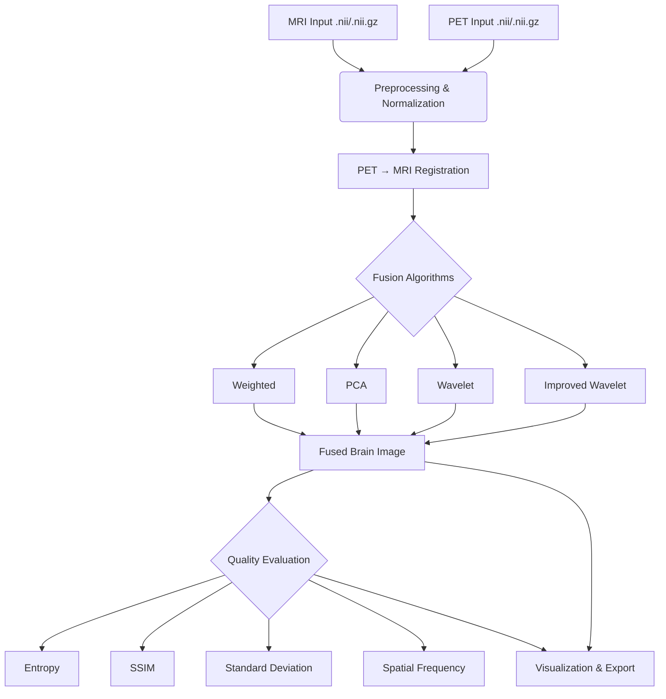
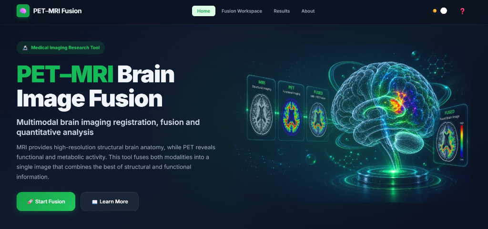
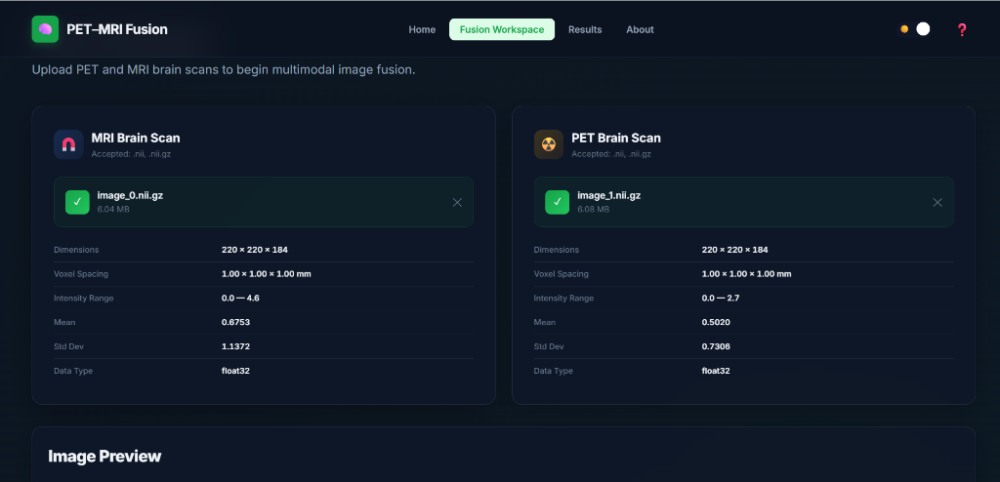
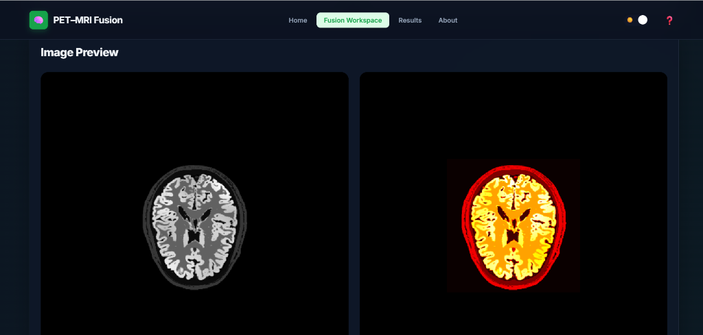
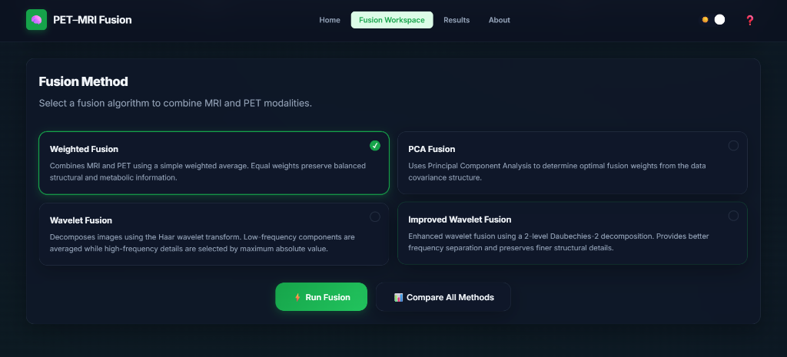
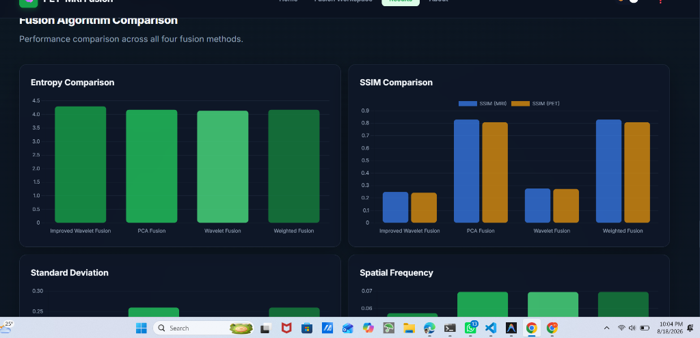

# 🧠 PET–MRI Brain Image Fusion


A premium glassmorphism medical imaging web interface for multimodal brain image fusion — combining structural information from MRI with functional/metabolic information from PET using advanced fusion algorithms.

---

## ⚠️ Disclaimer
**This project is strictly intended for research and educational demonstrations. It is not a diagnostic medical device and must not be used for clinical diagnosis or medical decision-making.**

---

## Project Overview

Magnetic Resonance Imaging (MRI) provides high-resolution anatomical structure, while Positron Emission Tomography (PET) provides crucial metabolic and functional information. This workstation spatially aligns these two modalities and merges them into a single, fused representation, preserving critical information from both source images.

### Key Features
- **Premium Glassmorphism UI**: Modern frosted-glass interface with light/dark theme support.
- **NIfTI Support**: Native loading and processing of `.nii` and `.nii.gz` volumetric data.
- **Automated Registration**: Rigid spatial alignment (PET → MRI) using SimpleITK with Mattes Mutual Information.
- **Multiple Fusion Algorithms**: Weighted, PCA, Wavelet, and Improved Wavelet fusion techniques.
- **Real-time Image Viewer**: Axial, coronal, and sagittal slice navigation with synchronized comparison views.
- **Color Composite Rendering**: Fused images displayed as MRI structure + PET metabolic color overlay.
- **Quantitative Evaluation**: Entropy, SSIM, Standard Deviation, and Spatial Frequency metrics.
- **Algorithm Comparison**: Interactive Chart.js charts comparing all four fusion methods.
- **Export Capabilities**: Download fused NIfTI volumes, registered PET, metrics reports, and PNG visualizations.
- **Responsive Design**: Works on desktop, tablet, and mobile.

---

## Image Processing Pipeline



---

## Fusion Methods

1. **Weighted Fusion**: Linear intensity blending of the two modalities `(Fused = α × MRI + β × PET)`.
2. **PCA Fusion**: Principal Component Analysis extracts optimal fusion weights from the data covariance structure, preserving the most important information from both modalities.
3. **Wavelet Fusion**: Haar wavelet decomposition — low-frequency components averaged, high-frequency details selected by maximum absolute value.
4. **Improved Wavelet Fusion**: Enhanced 2-level Daubechies-2 (db2) wavelet decomposition for finer frequency separation and better detail preservation.

---

## Evaluation Metrics

| Metric | Description |
|---|---|
| **Entropy** | Measures information content — higher entropy indicates richer fused image |
| **SSIM** | Structural similarity to MRI and PET — values closer to 1.0 indicate better preservation |
| **Standard Deviation** | Assesses overall contrast and intensity variation |
| **Spatial Frequency** | Measures spatial detail and edge activity preservation |

---

## Results

*Experimental results from the testing dataset. Not clinical performance standards.*

| Method | Entropy | MRI SSIM | PET SSIM | STD | Spatial Frequency |
|---|---:|---:|---:|---:|---:|
| Weighted | 2.9407 | 0.7906 | 0.6763 | 0.2835 | 0.0929 |
| PCA | 3.0393 | 0.8069 | 0.8065 | 0.2744 | 0.0748 |
| Wavelet | 2.9879 | 0.2867 | 0.2694 | 0.1920 | 0.0775 |
| Improved Wavelet | 3.1772 | 0.2697 | 0.2621 | 0.1827 | 0.0807 |

---

## 📸 Screenshots

### Hero Section (Dark Theme)


### Fusion Workspace — Upload Panels


### Image Preview — MRI & PET Scans


### Fusion Method Selection


### Algorithm Comparison Results


---

## Architecture

```
Browser (HTML/CSS/JS)  ──REST API──▶  Flask Server (server.py)
                                           │
                                           ├── src/preprocessing.py
                                           ├── src/registration.py
                                           ├── src/fusion_methods.py
                                           └── src/evaluation.py
```

**Frontend**: Vanilla HTML + CSS + JavaScript (glassmorphism design, Chart.js for charts)
**Backend**: Flask — wraps existing `src/` processing modules as REST API endpoints

### API Endpoints

| Endpoint | Method | Purpose |
|---|---|---|
| `/api/upload/mri` | POST | Upload & validate MRI NIfTI |
| `/api/upload/pet` | POST | Upload & validate PET NIfTI |
| `/api/slice/<type>/<axis>/<index>` | GET | Get a slice as base64 PNG |
| `/api/fuse` | POST | Register + fuse + evaluate (single method) |
| `/api/fuse/all` | POST | Run all 4 fusion methods + compare |
| `/api/download/<key>` | GET | Download generated NIfTI/reports/PNGs |

---

## Technologies Used

- **Python**: Core programming language.
- **Flask**: Lightweight web server and REST API.
- **SimpleITK**: Medical image registration and alignment.
- **NiBabel**: NIfTI file I/O operations.
- **scikit-image**: Structural similarity (SSIM) and image processing.
- **PyWavelets**: Wavelet decomposition and fusion.
- **NumPy / SciPy / Pandas**: Numerical computation and data management.
- **Matplotlib**: Server-side image slice rendering.
- **Chart.js**: Interactive frontend comparison charts.

---

## Project Structure

```text
PET_MRI_Fusion/
├── server.py                      # Flask web server & REST API
├── website/
│   ├── index.html                 # Single-page application (all sections)
│   ├── css/
│   │   └── style.css              # Glassmorphism design system (light/dark)
│   └── js/
│       └── app.js                 # Frontend logic (uploads, viewers, charts)
├── src/
│   ├── __init__.py                # Package init
│   ├── preprocessing.py           # Image normalization & NIfTI validation
│   ├── registration.py            # PET → MRI alignment (SimpleITK)
│   ├── fusion_methods.py          # Fusion algorithms (Weighted, PCA, Wavelet, Improved Wavelet)
│   └── evaluation.py              # SSIM, Entropy, Spatial Frequency metrics
├── dataset/                       # Input NIfTI brain scans (not in repo)
├── uploads/                       # Temporary uploaded files (auto-created)
├── outputs/                       # Generated fused images & reports (auto-created)
├── results/                       # Pre-generated results
├── docs/
│   └── screenshots/               # UI screenshots for README
├── requirements.txt               # Python dependencies
├── .gitignore                     # Exclusion rules
└── README.md                      # This file
```

*Note: Large medical datasets (`dataset/`), uploaded files (`uploads/`), and generated outputs (`outputs/`, `results/`) are excluded from version control.*

---

## Installation

**Prerequisites:** Python 3.12

### Windows

```powershell
git clone <repository-url>
cd PET_MRI_Fusion
python -m venv .venv
.venv\Scripts\Activate.ps1
python -m pip install --upgrade pip
pip install -r requirements.txt
```

### macOS / Linux

```bash
git clone <repository-url>
cd PET_MRI_Fusion
python3 -m venv .venv
source .venv/bin/activate
pip install --upgrade pip
pip install -r requirements.txt
```

---

## How to Run

Start the Flask web server:

```bash
python server.py
```

Open **http://localhost:5000** in your browser.

### User Flow

1. **Open website** → premium glassmorphism hero section
2. **Click "Start Fusion"** → scrolls to workspace
3. **Upload MRI** → drag & drop `.nii.gz` file → validates, shows metadata + preview
4. **Upload PET** → drag & drop `.nii.gz` file → validates, shows metadata + preview
5. **Select fusion method** → Weighted / PCA / Wavelet / Improved Wavelet
6. **Click "Run Fusion"** → processing overlay with pipeline animation
7. **View fused image** → color composite with axial/coronal/sagittal navigation
8. **Compare side-by-side** → MRI vs PET vs Fused (synchronized slices)
9. **Review metrics** → Entropy, SSIM, Std Dev, Spatial Frequency
10. **Compare all methods** → Chart.js bar charts + results table
11. **Download results** → NIfTI files, metrics reports, PNG visualizations

---

## Limitations

- Fusion quality depends on the resolution and quality of input images.
- Rigid registration may not account for patient movement or soft tissue deformation between scans.
- Quantitative metrics (like SSIM and Entropy) do not guarantee clinical validity.
- Different imaging protocols and scanner hardware may produce varying results.
- Processing time depends on volume size — large 3D volumes may take several minutes on CPU.

---

## Future Improvements

- Implementation of non-rigid (deformable) registration algorithms.
- Deep Learning-based fusion methods (e.g., GANs, CNNs).
- 3D volumetric rendering and interactive overlay tools.
- GPU acceleration for real-time processing of large high-resolution volumes.
- Batch processing pipeline for large-scale dataset evaluation.
- WebSocket-based real-time processing progress updates.

---

## License

License information will be added.

---

## Author
**Mallikarjuna K**
- **Email**: [mallikamanu2003k@gmail.com](mailto:mallikamanu2003k@gmail.com)
- **LinkedIn**: [Mallikarjuna K](https://www.linkedin.com/in/mallikarjuna-k-b95881255/)
